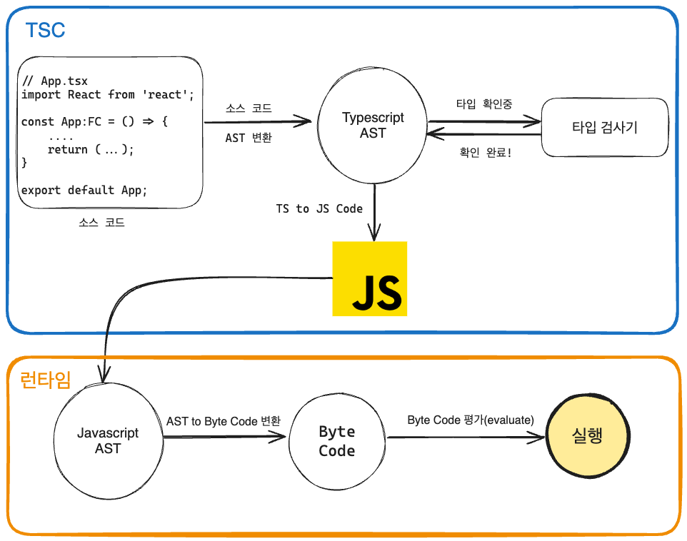
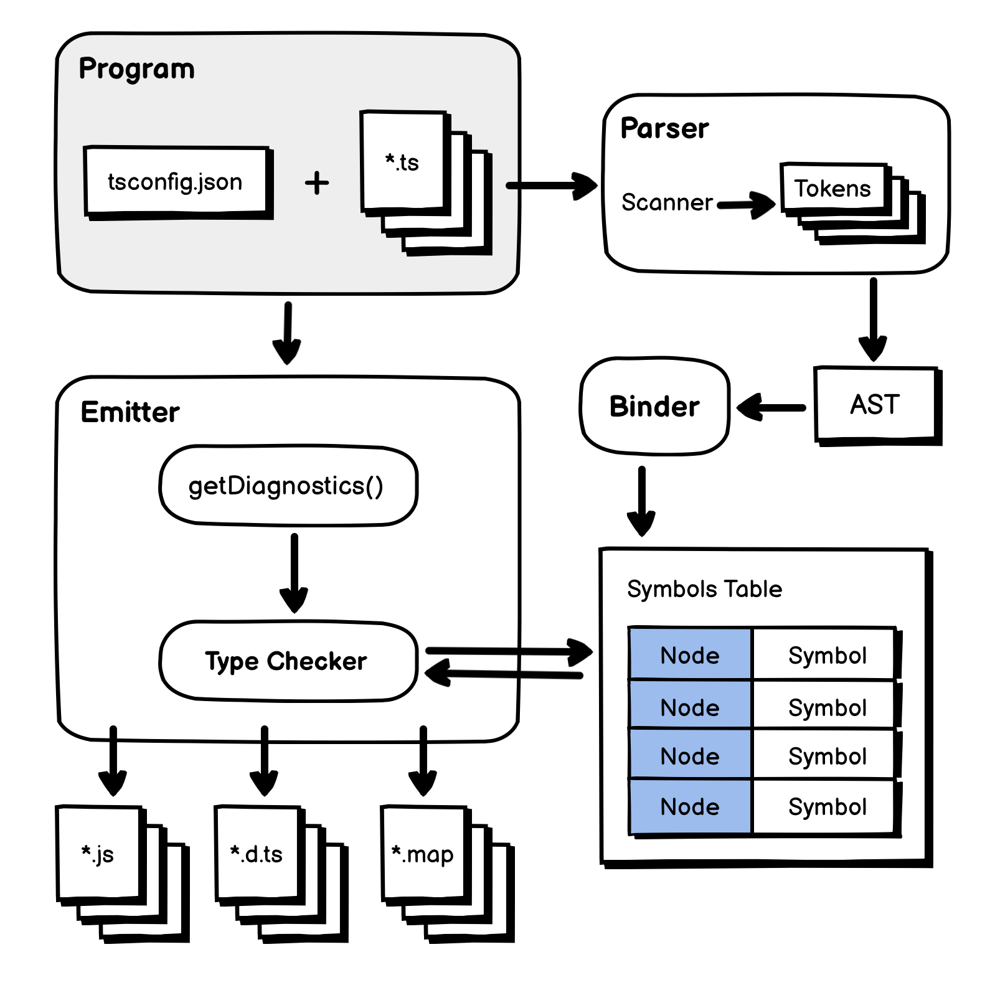

# 자바스크립트의 런타임과 타입스크립트의 컴파일
## 런타임과 컴파일타임
1. `컴파일타임(compile time)`: 소스코드는 컴파일러에 의해 기계어 코드로 변환되어 실행이 가능한 프로그램이되는 단계
2. `런타임(runtime)`: 소스코드의 컴파일이 완료되면 프로그램이 메모리에 적재되어 실행되는 시간

## 자바스크립트 런타임
- 자바스크립트는 대표적인 인터프리터(interpreter)언어이다. 이는 별도의 컴파일 과정이 존재하지 않는다고 알려져 있지만, 엄밀히 컴파일 단계가 존재한다. 
- 해석하고 실행하는 역할을 하는 V8 엔진은 때때로 자바스크립트 코드를 최적화하기 위해 컴파일 단계를 거치고 이 과정은 실행 속도를 향상하기 위한 목적으로 JS 코드를 캐싱하여 이후 실행 시간을 단축한다.

## 타입스크립트의 컴파일
타입스크립트는 tsc라고 불리는 컴파일러를 통해 JS 코드로 변환되는데, 이 과정이 저수준에서 고수준 언어로 변환되는 것이 아니라 <u>고수준 언어(TS)에서 또 다른 고수준 언어(JS)로 변환되는 것. 때문에 컴파일이 아닌 트랜스 파일(transpile)</u>이라고도 한다. 

- 트랜스파일의 다른 예시로 C/C++ 코드를 JS로 변환하는 Emscripten과 Javascript ES6 버전 이상의 문법을 ES5 버전 이하의 문법으로 변환하는 바벨(Babel)등을 들 수 있다. 
- 좁은 의미의 컴파일(고->저수준 변환)과 트랜스파일(고->고 변환)을 통 틀어 컴파일이라고 부르기도함

- 타입스크립트 컴파일러는 소스코드를 해석해서 AST를 만들고 이후 타입 확인을 거친 다음에 결과 코드를 생성한다.

- 타입 스크립트 컴파일러가 소스코드를 컴파일하여 프로그램이 실행되기까지의 과정
- AST(Abstract Syntax Tree): 컴파일러가 소스코드를 해석하는 과정에서 생성된 데이터 구조. 코드를 노드 단위의 트리 구조로 구성
 

*TSC & Runtime 흐름도*

# 타입스크립트 컴파일러의 동작
## 코드 검사기로서의 타입스크립트 컴파일러
타입스크립트 컴파일러는 tsc binder를 사용하여 타입 검사를 하며, 컴파일타임에 타입 오류를 발견한다. 타입 검사를 거쳐 코드를 안전하게 만든 이후에는 타입스크립트 AST를 자바스크립트 코드로 변환한다.

[타입 검사후 에러 메세지 json 모음](https://github.com/microsoft/typescript/blob/main/src/compiler/diagnosticMessages.json)

## 코드 변환기로서의 타입스크립트 컴파일러
타입스크립트 컴파일러는 타입을 검사한 다음에 타입스크립트 코드를 각자의 런타임 환경에서 동작할 수 있도록 구버전의 자사스크립트로 트랜스파일한다.

타입 스크립트 컴파일러의 [target](https://www.typescriptlang.org/ko/tsconfig#target) 옵션을 사용하여, 특정 버전의 자바스크립트 소스코드로 컴파일할 수 있다.

tsc와 바벨은 ES5 이하의 자바스크립트 코드로 컴파일해준다는 점에서는 동일하다. 하지만 tsc와 달리 바벨은 타입 검사를 하지 않는다.

# 타입스크립트 컴파일러의 구조

*TSC 내부 구조*

(출처: https://velog.io/@sehyunny/how-ts-compiler-compiles)

## 프로그램(Program)
- 전체적인 컴파일 과정을 관리하는 `프로그램 객체(인스턴스) 생성`
- 이 객체는 컴파일할 <u>TS 소스 파일과 소스 파일 내에 import된 파일</u>을 불러옴 -> 가장 `최초`로 불러온 파일 기준으로 `컴파일 시작`

## 스캐너(Scanner)
- TS to JS 변환을 위한 첫 번째 단계이며, TS 파일을 어휘적 분석(lexical analysi)하여 `토큰 생성 역할`
- [TS의 최소 단위 토큰 리스트 SyntaxKind 변수](https://github.com/microsoft/TypeScript/blob/main/src/compiler/types.ts#L40)

[(Play) 스캐너 Plugin](https://www.typescriptlang.org/play?#code/GYVwdgxgLglg9mABAEzgZSiZBPAFAZwAcBTAQwGtiAnALnyipjAHMBKRAbwChFEIF8cADbEAdELjNcAIkA4PYB0VwAnjNaQBoiZSlVYBuLgF8uqDFjwByACqlCZ1lyA)

## 파서(Parser)
- 스캐너가 소스 파일을 토큰으로 나눠주면서  파서는 그 토큰 정보를 이용하여 AST를 생성.
- `AST`는 컴파일러가 동작하는 핵심 기반이 되는 `자료구조`, 소스 코드의 구조를 트리 형태로 표현
- AST의 최상위 노드(TS file), 최하위 노드(EOF)로 구성 

[(Play) Typescript AST Viwer](https://ts-ast-viewer.com/#code/PTAEGcBcCcEsDsDmoBQBjA9vKoD68BDAWwFNQBeUAckgIAcqBudLcDAGxIDp2NEAKfMRIBKZkNIVQAZmYoQoAGYBXeGkiwsKFWo1YlqtPxGgA3ilCXQmbB268BAIgBihvfFABhAu3YBCRxEUAF9tQ2NGIA)

## 바인더(Binder)
- 체커(check) 단계에서 타입 검사하도록 기반을 마련하는 것
- 심볼(Symbol)이라는 데이터 구조 생성
- 이전 단계에서 선언한 AST의 노드 정보 저장
- 바인더는 심볼을 생성하고 그 심볼과 대응하는 AST를 연결하는 역할

[(Play) 심볼 선언 시각화 플러그인](https://www.typescriptlang.org/play?&install-plugin=playground-ts-symbols#code/C4TwDgpgBAyg9gWwgFXNAvFAzsATgSwDsBzKAHykIFcEAjCXAbgCgjgGAzAQwGNp4kASULtc3PlADezKJS5IAXNjxFiLWV2IQA-Eup0GLAL7MANhGBQOcOEpwESUTACIAMgFFkzljziEcUHC0AFZOUjJyilAA5IAu44AhndEANBGaEEoAjAAMzCbMPKZcWFhQALIgAMKFxeGyhPIQ6lBpLBG+-nhUPMBwuAAU9VH2qknNWrqUNPS4AJS1slDAABb4WAB0gxiRjRGyy6traWEtESZ57QFcuHAA7gBiVITd+H5hfXPoAHxSRiwcj89XoRegguKYHk9gC9CO8fq0rrcIYCYTMWMDcKDwQCoX53j4-AFfKYiGFCBAbmVKtUsH1nESiM5UUA)

## 체커(Checker)
- 체커는 파서가 생성한 `AST`와 바인더가 생성한 `Symbol`을 이용해서 `타입 검사를 수행`
- 체커의 소스 코드 크기는 2.7MB와 이전 단계의 파서의 소스크기는 500KB. 
  >전체 컴파일 과정에서 타입 검사가 차지하는 비중이 가장 큼
- 체커의 타입 검사는 `이미터에서 실행`
- 체커의 `getDiagnostics()`에서 타입 검증 후 타입 에러 정보를 보여줄 메시지를 저장

## 이미터(Emitter)
- TS 소스 코드를 `.js`파일과 `d.ts` 파일로 생성
- 이미터는 개발자가 설정한 ts 설정 파일(`tsconfig.json`)을 읽어오고 체커를 통해 코드에 대한 타입 검증 정보를 가져옴.
- `emitter.ts` 소스 파일 내부의 `emitFiles()`를 사용하여 TS 소스 변환을 진행